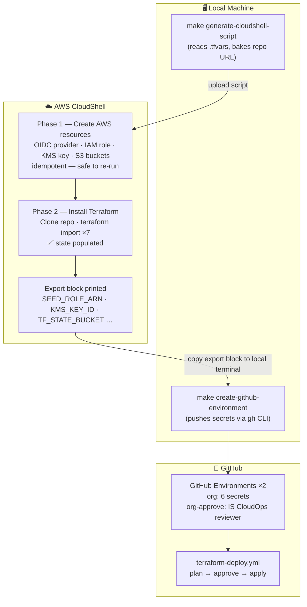

# Tenant Seed — AWS Bootstrap & Terraform Control Plane

This repository bootstraps a new AWS management-account tenant end-to-end:
creates the OIDC provider, IAM role, KMS key, and S3 state buckets via a
one-time CloudShell script, imports them into Terraform state, then hands
off to a fully automated GitHub Actions plan/apply pipeline for all future
changes.

---

## Table of Contents

1. [How It Works](#1-how-it-works)
2. [Prerequisites](#2-prerequisites)
3. [First-Time Local Setup](#3-first-time-local-setup)
4. [Onboarding a New Tenant](#4-onboarding-a-new-tenant)
   - [Step 1 — Create the org config](#step-1--create-the-org-config)
   - [Step 2 — Generate the CloudShell script](#step-2--generate-the-cloudshell-script)
   - [Step 3 — Get your GitHub token](#step-3--get-your-github-token)
   - [Step 4 — Run the bootstrap in CloudShell](#step-4--run-the-bootstrap-in-cloudshell)
   - [Step 5 — Export secrets to your local terminal](#step-5--export-secrets-to-your-local-terminal)
   - [Step 6 — Push secrets to GitHub](#step-6--push-secrets-to-github)
   - [Step 7 — Trigger the pipeline](#step-7--trigger-the-pipeline)
5. [Directory Layout](#5-directory-layout)
6. [Makefile Reference](#6-makefile-reference)
7. [Troubleshooting](#7-troubleshooting)

---

## 1. How It Works



**Why CloudShell?**
Terraform cannot create its own S3 state bucket — it needs the bucket to
exist *before* `terraform init`. CloudShell runs inside your AWS account
with no credentials to manage; it is the safest place to create those seed
resources.

**Why imports in CloudShell?**
After Phase 1 creates the resources, Phase 2 runs `terraform import` for
each one so Terraform immediately owns them. There is no separate "bootstrap
mode" or import flag in the pipeline — it is always a standard plan/apply.

---

## 2. Prerequisites

You need the following tools installed **on your local machine**.
CloudShell needs nothing pre-installed — the bootstrap script handles it.

### 2.1 Required tools

| Tool | Min version | Purpose |
|---|---|---|
| [Git](https://git-scm.com/downloads) | any | clone, commit, push |
| [GitHub CLI (`gh`)](https://cli.github.com/) | 2.x | auth token + push secrets |
| [AWS CLI v2](https://docs.aws.amazon.com/cli/latest/userguide/getting-started-install.html) | 2.x | local plan/validate (optional for bootstrap) |
| [Terraform](https://developer.hashicorp.com/terraform/install) | ≥ 1.14.5 | local plan/validate (optional for bootstrap) |
| [uv](https://docs.astral.sh/uv/getting-started/installation/) | any | Python toolchain for pre-commit |

> **Windows users:** All commands in this guide are `bash`. Use
> [Git Bash](https://gitforwindows.org/), [WSL2](https://learn.microsoft.com/en-us/windows/wsl/install),
> or the [Windows Terminal](https://aka.ms/terminal) with WSL. PowerShell
> equivalents are noted where they differ.

### 2.2 Install GitHub CLI

<details>
<summary><strong>macOS</strong></summary>

```bash
brew install gh
```

</details>

<details>
<summary><strong>Windows (winget)</strong></summary>

```powershell
winget install --id GitHub.cli
```

</details>

<details>
<summary><strong>Linux (apt)</strong></summary>

```bash
(type -p wget >/dev/null || (sudo apt update && sudo apt-get install wget -y)) \
  && sudo mkdir -p -m 755 /etc/apt/keyrings \
  && out=$(mktemp) && wget -nv -O$out https://cli.github.com/packages/githubcli-archive-keyring.gpg \
  && cat $out | sudo tee /etc/apt/keyrings/githubcli-archive-keyring.gpg > /dev/null \
  && sudo chmod go+r /etc/apt/keyrings/githubcli-archive-keyring.gpg \
  && echo "deb [arch=$(dpkg --print-architecture) signed-by=/etc/apt/keyrings/githubcli-archive-keyring.gpg] https://cli.github.com/packages stable main" | sudo tee /etc/apt/sources.list.d/github-cli.list > /dev/null \
  && sudo apt update && sudo apt install gh -y
```

</details>

### 2.3 Authenticate GitHub CLI

```bash
gh auth login
```

Follow the prompts. Choose **GitHub.com → HTTPS → Login with a web browser**.
When done, verify:

```bash
gh auth status
```

You should see `✓ Logged in to github.com`.

### 2.4 AWS access

You need an AWS IAM user or SSO session with **AdministratorAccess** (or
equivalent) on the management account. Verify you can reach the account:

```bash
aws sts get-caller-identity
```

> **CloudShell users:** When you open CloudShell inside the AWS console,
> credentials are injected automatically — no `aws configure` needed.

---

## 3. First-Time Local Setup

Clone the repo and run the one-shot setup target:

```bash
git clone https://github.com/BT-IT-Infrastructure-CloudOps/aws-terraform-infra-cloudops-tenant-seed.git
cd aws-terraform-infra-cloudops-tenant-seed
make setup
```

`make setup` installs Terraform, uv, pre-commit, and configures git hooks.
It is safe to run more than once — it skips anything already installed.

> **Windows (Git Bash):** `sudo` is not available. Install Terraform
> manually from https://developer.hashicorp.com/terraform/install and place
> it on your `PATH`, then re-run `make setup`.

---

## 4. Onboarding a New Tenant

Replace `<org>` throughout with your org slug, e.g. `fdr-cmc`.

---

### Step 1 — Create the org config

Copy an existing tfvars file and update the values:

```bash
cp configs/orgs/fdr-cmc.tfvars configs/orgs/<org>.tfvars
```

Edit the new file. Key fields:

| Field | Description | Example |
|---|---|---|
| `org` | Short org identifier used in resource names | `"fedramp"` |
| `partition` | AWS partition | `"aws"` or `"aws-us-gov"` |
| `aws_region` | Primary region | `"us-east-1"` |
| `organization_id` | AWS Org ID (`o-...`) | `"o-abc123"` |
| `github_oidc_subjects` | Which repo/environment may assume the role | see below |
| `github_approver_teams` | GitHub team slugs required to approve deployments | `["is-cloudops"]` |
| `target_organizational_unit_ids` | OUs to deploy member roles into | `["ou-..."]` |

**`github_oidc_subjects` example** (replace `<org>` with your slug):

```hcl
github_oidc_subjects = [
  "repo:BT-IT-Infrastructure-CloudOps/aws-terraform-infra-cloudops-tenant-seed:ref:refs/heads/main",
  "repo:BT-IT-Infrastructure-CloudOps/aws-terraform-infra-cloudops-tenant-seed:environment:<org>"
]
```

Commit the new tfvars:

```bash
git add configs/orgs/<org>.tfvars
git commit -m "feat: add <org> org config"
git push
```

---

### Step 2 — Generate the CloudShell script

```bash
make generate-cloudshell-script ORG=<org>
```

This reads `configs/orgs/<org>.tfvars`, bakes all config values and the
repo URL into a self-contained script, and writes it to:

```
cloudshell/<org>/<org>-bootstrap.sh
```

> The generated script is **gitignored** — it contains no secrets but is
> regenerated each time to stay in sync with the tfvars.

---

### Step 3 — Get your GitHub token

The bootstrap script needs a GitHub token to clone this (private) repo
inside CloudShell. Run this locally to get the exact export string to
paste:

```bash
echo "export GITHUB_TOKEN=$(gh auth token)"
```

Copy the entire output line. It will look like:

```
export GITHUB_TOKEN=gho_xxxxxxxxxxxxxxxxxxxx
```

> **Windows PowerShell alternative:**
> ```powershell
> Write-Host "export GITHUB_TOKEN=$(gh auth token)"
> ```
>
> **If `gh auth token` returns nothing:** Re-authenticate with
> `gh auth login` and ensure you granted the `repo` scope.

---

### Step 4 — Run the bootstrap in CloudShell

1. Open the [AWS CloudShell console](https://console.aws.amazon.com/cloudshell/)
   in the **management account** (ensure you are in the correct region).

2. Upload the generated script using the **Actions → Upload file** button
   in the top-right of the CloudShell panel. Navigate to:
   `cloudshell/<org>/<org>-bootstrap.sh`

3. Paste your `export GITHUB_TOKEN=...` line from Step 3 into CloudShell
   and press Enter.

4. Run the script:

   ```bash
   bash <org>-bootstrap.sh
   ```

   > **Do not use `./`** — CloudShell may restrict executable permissions.
   > `bash <script>` always works.

**What happens:**

| Phase | What it does |
|---|---|
| **Phase 1** | Creates (or verifies existing): OIDC provider, IAM role, KMS key + alias, state S3 bucket, logs S3 bucket. Fully idempotent — safe to re-run. |
| **Exports block** | Prints `export VAR=value` lines for the next step. |
| **Phase 2** | Auto-installs Terraform 1.14.5 to `~/bin` if missing. Clones this repo into `/tmp/seed-repo`. Runs `terraform init` + 7 `terraform import` commands to bring all resources under Terraform management. |

A successful run ends with:

```
✅ Bootstrap + imports complete.
Next steps:
  1. Export secrets to GitHub:  make create-github-environment ORG=<org>
  2. Trigger the GitHub Actions workflow: terraform-deploy.yml → org: <org>
```

> **If Phase 2 fails with "Backend configuration changed":**
> The `/tmp/seed-repo` directory has a stale backend config from a previous
> run. Delete it and re-run:
> ```bash
> rm -rf /tmp/seed-repo && bash <org>-bootstrap.sh
> ```

---

### Step 5 — Export secrets to your local terminal

During Phase 1 the script prints an export block. Copy all lines from the
CloudShell output and paste them into your **local terminal** (not
CloudShell):

```bash
export SEED_ROLE_ARN="arn:aws:iam::123456789012:role/..."
export TF_STATE_BUCKET="..."
export TF_LOGS_BUCKET="..."
export KMS_ALIAS="alias/..."
export KMS_KEY_ID="..."
export AWS_REGION="us-east-1"
export AWS_DEFAULT_REGION="us-east-1"
```

> **These are session-scoped.** If you close your terminal before Step 6,
> you will need to re-run the bootstrap script and copy the block again.
> It is safe to do so — Phase 1 is idempotent and Phase 2 will skip
> already-imported resources.

> **Windows PowerShell note:** The export block uses `bash` syntax.
> In PowerShell, use:
> ```powershell
> $env:SEED_ROLE_ARN = "arn:aws:iam::..."
> $env:TF_STATE_BUCKET = "..."
> # etc.
> ```
> Or switch to Git Bash / WSL before pasting.

---

### Step 6 — Push secrets to GitHub

With the exports active in your local terminal, run:

```bash
make create-github-environment ORG=<org>
```

This creates (or updates) **two** GitHub Environments and pushes secrets:

**`<org>`** — used by plan and apply jobs (secrets, no approval gate):

| Secret | Source |
|---|---|
| `SEED_ROLE_ARN` | CloudShell export |
| `TF_STATE_BUCKET` | CloudShell export |
| `TF_LOGS_BUCKET` | CloudShell export |
| `KMS_KEY_ID` | CloudShell export |
| `ORG_GITHUB_TOKEN` | Local `GITHUB_TOKEN` (private module downloads) |
| `PLAN_PASSPHRASE` | Auto-generated |

**`<org>-approve`** — approval gate between plan and apply (no secrets):
- Required reviewers set from `github_approver_teams` in your tfvars
- The plan job runs without waiting for approval; only the apply is gated

> **Why two environments?** If the approval gate were on the secrets environment,
> the plan job would also block — approvers would be approving blind before seeing
> any plan output. The `-approve` environment gates only the plan → apply transition.

Verify in GitHub: **Settings → Environments** — you should see both `<org>` (6 secrets)
and `<org>-approve` (1 protection rule).

---

### Step 7 — Trigger the pipeline

Go to **GitHub Actions → `terraform-deploy.yml` → Run workflow** and fill
in:

| Input | Value |
|---|---|
| Organisation | `<org-slug>` |

> Partition and region are read automatically from `configs/orgs/<org>.tfvars` — no manual entry required.

Click **Run workflow**.

**Plan job** runs first. Review the plan output — you should see Terraform
configuring sub-resources on the already-imported core resources (S3
versioning, lifecycle rules, public access blocks, KMS key policy, IAM
policy attachments, CloudFormation StackSet). There should be **no
deletions** of the core 7 resources.

The **Approve step** prompts for manual approval in the `<org>-approve`
GitHub Environment. Once approved, the **Apply job** runs and completes
the deployment.

A green apply means the tenant is fully bootstrapped and under Terraform
management. All future changes go through the normal PR → plan → apply
workflow.

---

## 5. Directory Layout

```
.
├── cloudformation/
│   └── member-role-stackset/    # CloudFormation module — deploys CICD
│                                #   IAM role to all member OUs
├── cloudshell/
│   └── <org>/                   # Generated bootstrap scripts (gitignored)
│       └── <org>-bootstrap.sh
├── configs/
│   └── orgs/
│       ├── fdr-cmc.tfvars       # Per-tenant config (committed)
│       └── fdr-gvc.tfvars
├── docs/                        # Supplementary design notes
├── seed-terraform/              # Terraform root — the control plane
│   ├── main.tf
│   ├── locals.tf
│   ├── variables.tf
│   └── versions.tf
├── tools/
│   ├── generate-cloudshell.sh   # Generates cloudshell/<org>/<org>-bootstrap.sh
│   ├── generate-delete.sh       # Generates a teardown script
│   └── create-gh-env.sh         # Pushes secrets to GitHub
├── .github/
│   └── workflows/
│       └── terraform-deploy.yml # Single plan + apply pipeline
└── Makefile
```

---

## 6. Makefile Reference

Run `make help` to see all targets. Most-used:

| Command | Description |
|---|---|
| `make setup` | Install Terraform, uv, pre-commit, git hooks |
| `make generate-cloudshell-script ORG=<org>` | Generate `cloudshell/<org>/<org>-bootstrap.sh` |
| `make create-github-environment ORG=<org>` | Push secrets to GitHub (requires exports from Step 5) |
| `make tf-validate ORG=<org>` | Validate Terraform config locally |
| `make precommit` | Run all pre-commit hooks |
| `make generate-cloudshell-delete-script ORG=<org>` | Generate a teardown script for the org |

---

## 7. Troubleshooting

### `gh auth token` returns nothing
Re-authenticate: `gh auth login`. When prompted for scopes, ensure `repo`
and `admin:org` are selected.

### CloudShell: "no space left on device"
The script now uses `/tmp` for Terraform providers (larger ephemeral disk).
If you hit this, delete the cached repo and re-run:
```bash
rm -rf /tmp/seed-repo && bash <org>-bootstrap.sh
```

### CloudShell: "Username for 'https://github.com'"
Terraform is trying to download a private module but git credentials are
not configured. This means `GITHUB_TOKEN` was not set before running the
script. Set it and re-run:
```bash
export GITHUB_TOKEN=gho_xxxx
bash <org>-bootstrap.sh
```

### Pipeline: `AccessDenied` on `cloudformation:CreateStackSet`
The bootstrap inline policy on the OIDC role is outdated. Re-run the
bootstrap script — Phase 1 always re-applies the policy with the latest
permissions (now includes `cloudformation:*` and `organizations:*`).

### Pipeline: `EntityAlreadyExists` for IAM policy or S3 bucket
A previous partially-failed apply created the resource but it fell out of
state. Re-run the bootstrap script — Phase 2 detects the orphaned resource
and re-imports it before the pipeline runs.

### Pipeline: `Saved plan is stale`
The state changed between plan and apply (usually a concurrent import).
Re-trigger the workflow — plan and apply will be in sync.

### `Backend configuration changed` in CloudShell
`/tmp/seed-repo` contains a stale backend config. Delete it:
```bash
rm -rf /tmp/seed-repo && bash <org>-bootstrap.sh
```

### `make create-github-environment` fails with "Missing SEED_ROLE_ARN"
The export variables from Step 5 are not set in your current terminal
session. Re-paste the export block from CloudShell, then retry.

### Wrong AWS account in CloudShell
CloudShell inherits the credentials of whichever account you are logged
into in the console. Check the account switcher in the top-right of the
AWS console before opening CloudShell.

---

> For visual architecture diagrams see [`docs/architecture.md`](docs/architecture.md).
