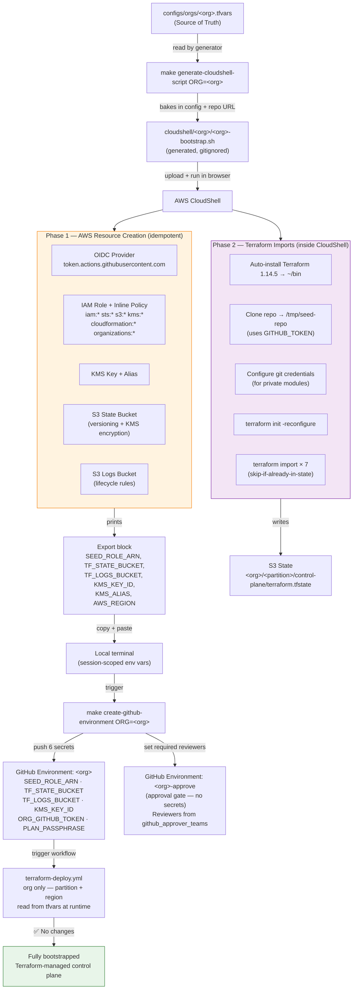
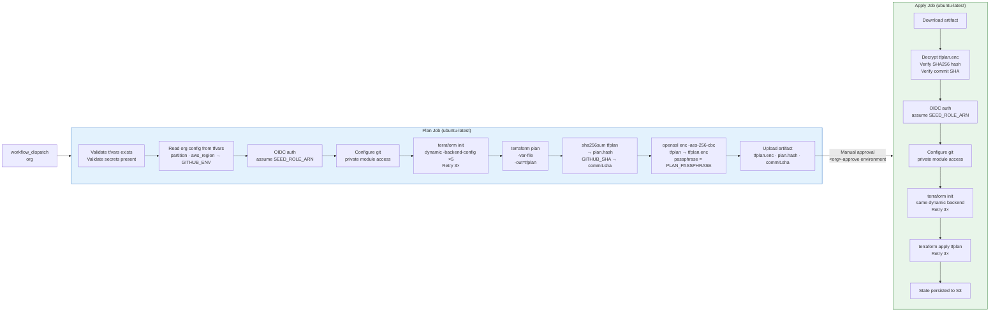
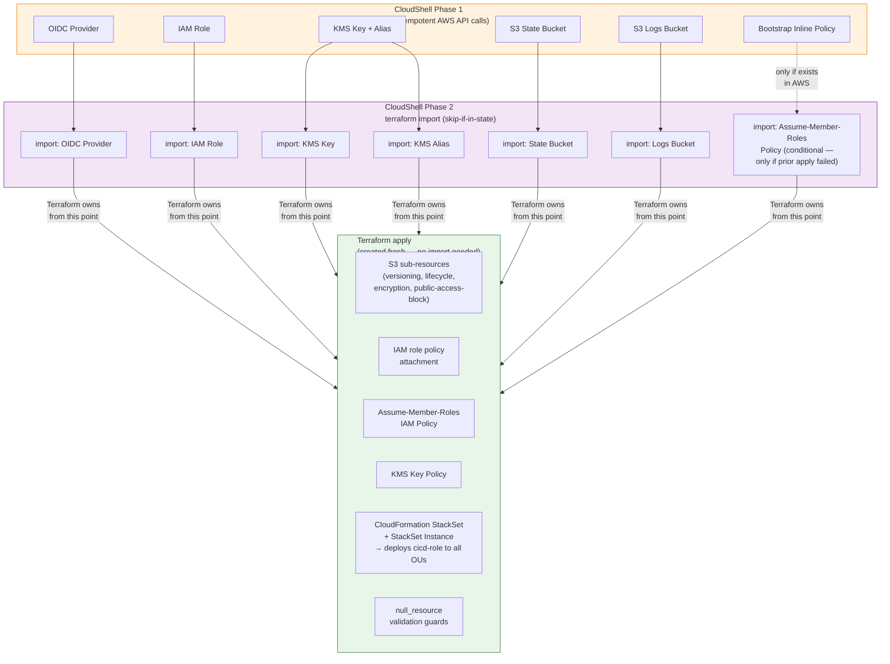

# Architecture Diagrams

Visual reference for the bootstrap flow, CI/CD pipeline, and resource ownership model.

---

## 1. End-to-End Bootstrap Flow



---

## 2. GitHub Actions Pipeline Flow

> **Note:** The workflow accepts a single input (`org`). Partition and region are derived automatically from `configs/orgs/<org>.tfvars` at runtime and exported into the job environment.



---

## 3. Resource Ownership Model



---

## 4. Naming System

All resource names derive from a single formula in `seed-terraform/locals.tf`:

```
name_prefix = <org> - <partition_short> - <region_short> - <system>
```

| tfvars field | Example | Contribution |
|---|---|---|
| `org` | `fedramp` | prefix segment 1 |
| `partition` | `aws` | → `partition_short = cmc` |
| `aws_region` | `us-east-1` | → `region_short = use1` |
| `system` | `infra-cloudops` | prefix segment 4 |
| **Result** | | `fedramp-cmc-use1-infra-cloudops` |

| Resource | Full name |
|---|---|
| S3 state bucket | `<name_prefix>-tfstate-<env>` |
| S3 logs bucket | `<name_prefix>-logs-<env>` |
| KMS alias | `alias/<name_prefix>-tfstate` |
| OIDC role (mgmt account) | `<name_prefix>-oidc-role` |
| Assume-member-roles policy | `<name_prefix>-assume-member-roles` |
| CloudFormation StackSet | `<name_prefix>-member-role` |
| CI/CD role (member accounts) | `<name_prefix>-cicd-role` |

> **Naming is a hard contract** — changing any segment breaks imports, the S3 backend key, cross-account role assumptions, and CI/CD trust.
